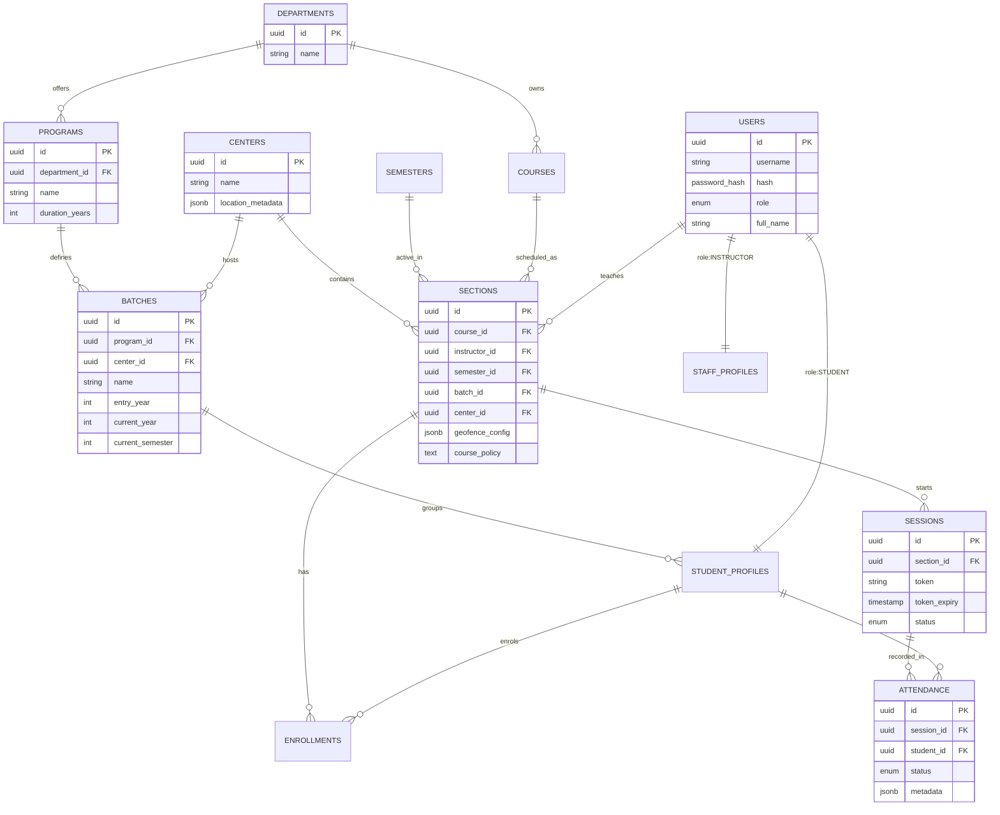

# Haramaya University Smart Attendance System

## 🎓 Project Overview
The Haramaya University Smart Attendance System is a comprehensive, full-stack solution designed to automate and digitize attendance tracking across multiple campuses, centers, and academic programs. It leverages **Smart Geofencing**, **Relational Synchronization**, and **Real-time Session Management** to ensure data integrity and security.

### Key Pillars
1.  **Identity Integrity**: Secure role-based access for Admins, Instructors, and Students.
2.  **Geographical Verification**: Geofencing ensures students can only mark attendance when physically present at the designated location (Center).
3.  **Autonomous Synchronization**: Database triggers handle enrollment logic automatically based on batch and center intersections.
4.  **Actionable Insights**: Real-time dashboards for monitoring attendance patterns and eligibility.

---

## 📊 Database Architecture (ERD)

The system uses a highly normalized PostgreSQL schema hosted on Supabase.



---

## 🛠 Technical Stack

### Frontend
-   **Framework**: React 18 with TypeScript
-   **Bundler**: Vite
-   **Styling**: Tailwind CSS (Custom Design System)
-   **State Management**: React Context API
-   **Animations**: Framer Motion
-   **Icons**: Lucide React

### Backend (Full-Stack API)
-   **Runtime**: Node.js (Vercel Edge Functions compatible)
-   **Framework**: Express.js
-   **Database**: PostgreSQL (Supabase)
-   **Real-time**: Supabase Realtime / PostgreSQL Triggers
-   **Auth**: JWT & Supabase Auth Integration

---

## 🚀 Business Logic & Triggers

### 1. The "Always-Sync" Principle
The system eliminates manual student list management through Database Triggers.
-   **`sync_enrollment_on_student_change`**: When a student's batch or center changes, they are automatically enrolled in all active sections matching that intersection.
-   **`sync_enrollment_on_section_change`**: When a new section is created, all students belonging to the matching Batch and Center are enrolled immediately.

### 2. Smart Geofencing
Every `Section` can have a custom circular geofence.
-   Students must be within `radius` meters of the `latitude`/`longitude` center to successfully mark attendance.
-   Calculations are verified server-side with metadata captured during the marking process.

### 3. Session Security
-   Instructors generate dynamic tokens for sessions.
-   Tokens stay valid for a set duration (e.g., 5 minutes) or until manually ended.
-   Attendance marking is restricted to `active` sessions only.

---

## 📁 Project Structure

```text
/
├── api/                # Express API (Serverless Routes)
│   └── index.ts        # Main Entry Point
├── server/             # Backend Business Logic
│   ├── db/             # Supabase Client
│   └── services/       # Import & Processing logic
├── src/                # Frontend
│   ├── components/     # UI Components
│   └── App.tsx         # Root Component
├── SUPABASE_SETUP.sql  # Database Schema
└── vercel.json         # Deployment Config
```

---

## ⚙️ Environment Variables
The system requires the following keys in your `.env` file:
```bash
SUPABASE_URL=your_supabase_url
SUPABASE_SERVICE_ROLE_KEY=your_service_role_key
JWT_SECRET=your_secure_random_string
GEMINI_API_KEY=your_gemini_key (for AI features)
```

---
**Developed for Haramaya University Final Year Project.**
